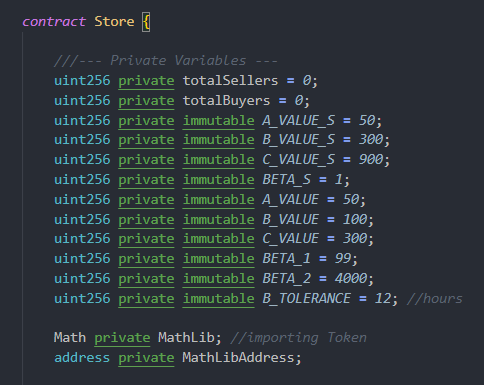

# Reputation_Mechanism
Building Reputation Mechanism on Blockchain

# Other Related Github Links
[Front End](https://github.com/S-Samiksha/reputation_mechanism_frontend) <br>
[Reputation Mechanism Simulation](https://github.com/S-Samiksha/Reputation_Mechanism_Simulations) <br>

# About this repository 

This repository contains the solidity codes for deploying the contract for E-commerce Platform. Solidity does not allow for decimals places! Hence, the library provided by [Vectorized](https://github.com/Vectorized/solady/blob/main/src/utils/FixedPointMathLib.sol) is used to help in calculating the reputation score. 

# Clone the repository and installing the packages

```bash
git clone https://github.com/S-Samiksha/Reputation_Mechanism
cd Reputation_Mechanism
yarn 
```

# Changing Variables

To change the variables that determine the reputation score, go into the store.sol file. These variables are further explained in [Reputation Mechanism Simulation](https://github.com/S-Samiksha/Reputation_Mechanism_Simulations). <br>



# Deploying the contract

To deploy to a private network: <br>

```bash
yarn hardhat node
```

To deploy to the Sepolia public network: <br>

Remember to add your sepolia private key to the environment variables. An example is provided at .env.example. <br>
If you would like to verify the contract, add your etherscan api key. <br>

```bash
yarn hardhat node --network sepolia
```

# Running scripts

To interact with the contract without running the frontend, scripts are available. 

```bash
yarn hardhat run scripts/<name_of_script>.js --network localhost 
```